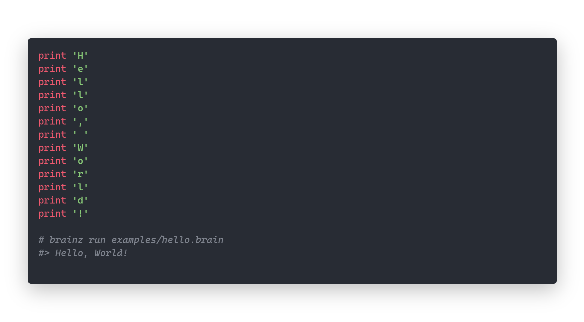

[](https://github.com/arthurfiorette/brainease/issues)
[](https://github.com/arthurfiorette/brainease/stargazers)
[](https://github.com/arthurfiorette/brainease/blob/main/LICENSE)
[](https://crates.io/crates/brainease)

<br />

<div align="center">
  <pre>
  <h1>🤯
Brainease</h1>
  </pre>
  <br />
</div>

<h3 align="center">
  <code>Brainease</code> is a brainf*ck-style programming language, but readable.
  <br />
  <br />
</h3>



<br />

```sh
$ cargo install brainease
```

<br />

<h3 align=center>
  <a href="https://arthurfiorette.github.io/brainease/" target="_blank">Documentation at <code>arthurfiorette.github.io/brainease</code></a>
</h3>

<br />

## License

The brainease compiler source and his documentation are released under **GPLv3**. See
[`LICENSE`](LICENSE) for more informations.

<br />

## Contact

See my contact information on my [github profile](https://github.com/arthurfiorette) or
open a new issue.

<br />
