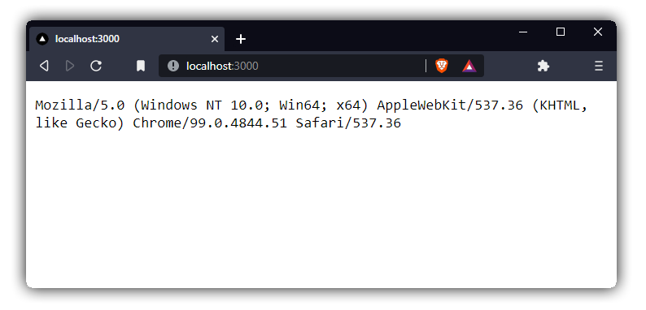

<br />

## A Brainease web app

This is a web app that returns your `User-Agent` to you in plain text. The tricky part is
that it is written in **Brainease**.



<br />

### How to run this app!

```sh
# clone and cd inside this repo

# build the app from source (If you have rust installed)
cargo build --release
# or download the latest binary
# https://github.com/arthurfiorette/brainease/releases

# Run the nodejs tcp listener
node examples/webserver
```

<br />

### How does this work?

There is a small TCP server written in NodeJS ([`index.js`](./index.js)) that's kind of
CGI for . It takes the bytes from a TCP stream and sends to the Brainease
([`main.brain`](./main.brain)) code.

The program reads the stdin, detects if it is a GET method. If not, returns a 404 error.
Then it parses and find the `User-Agent` header, and builds a new response with the
`User-Agent` as body in plain text.

<br />

### Inspiration

This _web server_ example is inspired by
[this](https://github.com/EvanHahn/brainfuck-web-app) version in `brainfuck`. Thanks
[@EvanHahn](https://github.com/EvanHahn) for the inspiration!

<br />
